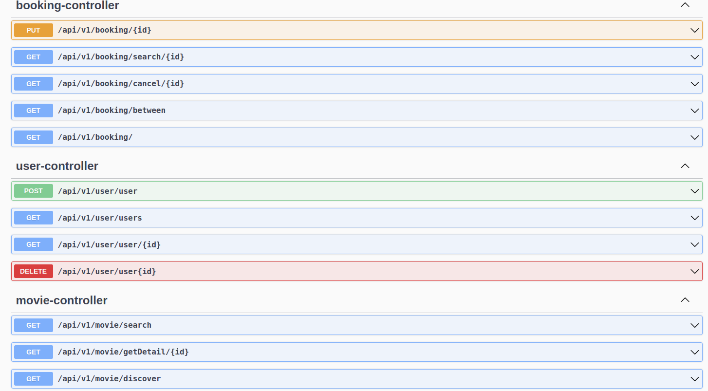
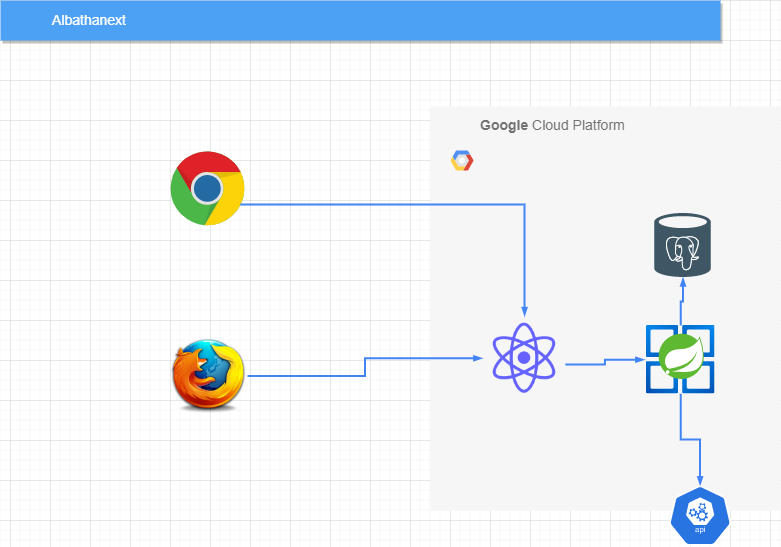

# Albathanext
You have to cd to project root, have java and maven setup already
# build
  1. mvn clean package
  2. docker-compose build
# deploy
  1. docker-compose up
  2. for swagger got to http://localhost:8080/swagger-ui/index.html
# swagger
****

## target design

